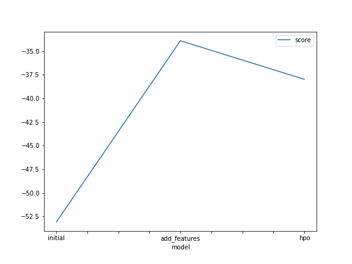
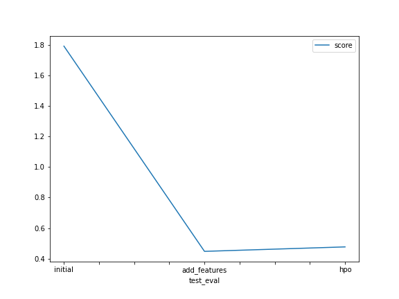

# Report: Predict Bike Sharing Demand with AutoGluon Solution
#### Raynold Panji Zulfiandi

## Initial Training
### What did you realize when you tried to submit your predictions? What changes were needed to the output of the predictor to submit your results?
Before submitting prediction results to kaggle, I noticed that `kaggle will reject the prediction if we don't set everything to be greater than 0`. In other cases, some prediction results have negative values due to `bad models`. Maybe because the model does not use `feature selection` which causes the model not to get enough patterns from the training data

### What was the top ranked model that performed?
The top ranking model is `WeightedEnsemble_L3` when adding some features from the EDA step whose model score is `-33.907843` 

## Exploratory data analysis and feature creation
### What did the exploratory analysis find and how did you add additional features?
-  When I tried EDA, I noticed that the `datetime` feature is sequential data, which is important for looking at time patterns to predict `bikecycling demand` in this case. But when using `datetime` in its entirety, the model also can't figure out the pattern. So the `datetime` feature has to be split into month, day, year, and hour to improve the model.
- About the `season` and `weather` features were changed to categorical, because these features clearly represent categorical data distribution. Previously, the feature value was an `integer` value that represented continuous data, therefore changing it to categorical could make it easier for the model to understand the data.

### How much better did your model preform after adding additional features and why do you think that is?
After the addition of the feature, the model improved performance by approximately 75%. Kaggle's score improved as decreased from 1.79038 to 0.44763 because selection process for the `datetime` feature

## Hyper parameter tuning
### How much better did your model preform after trying different hyper parameters?
The hyperparameter tuning does not improve the performance of the model in this case, the cost kaggle score increases from 0.44763 to 0.47686

### If you were given more time with this dataset, where do you think you would spend more time?
I will be doing more data analysis to investigate the importance of additional features and try to explore other feature engineering techniques.

### Create a table with the models you ran, the hyperparameters modified, and the kaggle score.
|model|hpo1|hpo2|hpo3|hpo4|score|
|--|--|--|--|--|--|
|initial|default|default|default|default|1.79038|
|add_features|default|default|default|default|0.44763|
|hpo|NN:activation (relu,softrelu,tanh)|NN:dropout (0.0,0.5)|GBM:num_leaves (lower=26,upper=66)|GBM:num_boost_round=100|0.47686|

### Create a line plot showing the top model score for the three (or more) training runs during the project.

### Create a line plot showing the top kaggle score for the three (or more) prediction submissions during the project.

## Summary
In this project, I think a useful process for improving the model is to use `EDA` to find out what features can make the model better. And using `hyperparameter tuning` to try to figure out what is the best of the model parameters I can work with.
